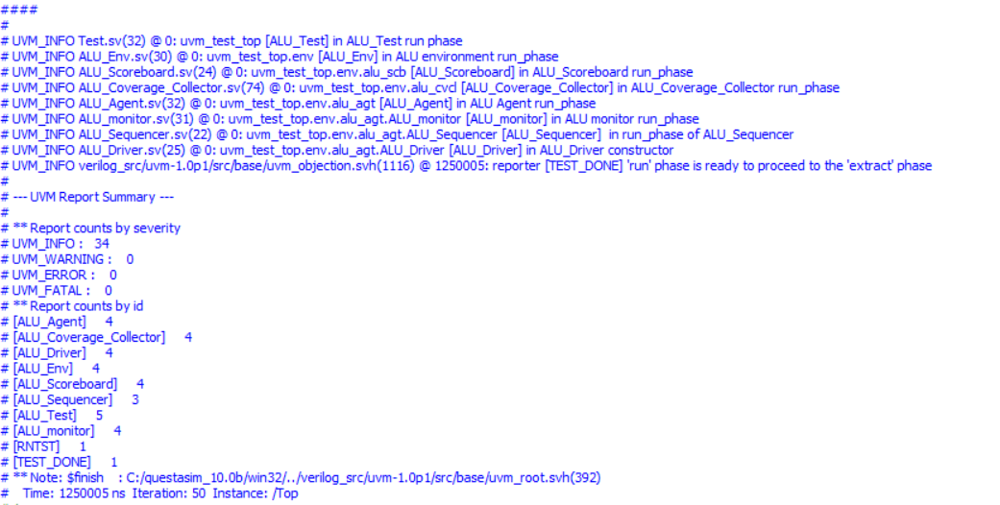
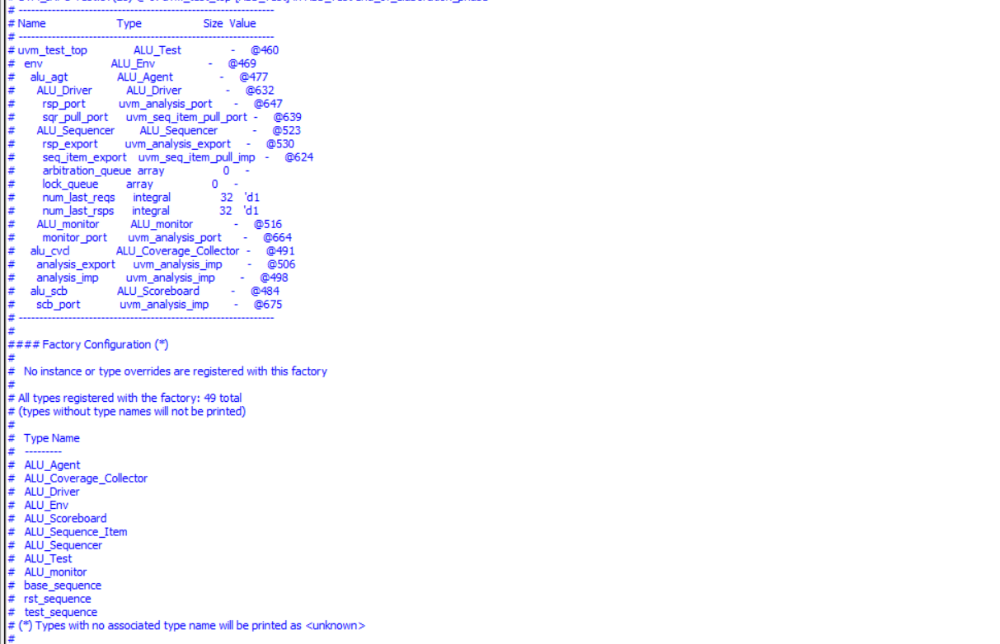

# ALU_UVM_Based_Testbench #
An ALU, or Arithmetic Logic Unit, is a fundamental component of a computer's central processing unit (CPU). It performs arithmetic and logic operations on the binary data provided to it. Here are the functions and characteristics of an ALU:

1- Arithmetic Operations: This includes basic operations such as addition, subtraction, multiplication, and division. 

2- Logic Operations: This includes operations such as AND, OR, NOT, XOR, and bit shifts. 

3- Data Processing: The ALU processes binary data and performs operations as instructed by the control unit of the CPU. 

4- Inputs and Outputs: Typically, an ALU has two data inputs (operands) and one output. It also has control inputs to select the  operation to be performed.

The ALU is a critical component for executing the instructions of a program, as it handles the necessary computations and logic decisions.
##  UVM Testbench Structure

## Report summary 

## Testbench Components And Objects That Registered In Factory

##  Coverage Results

